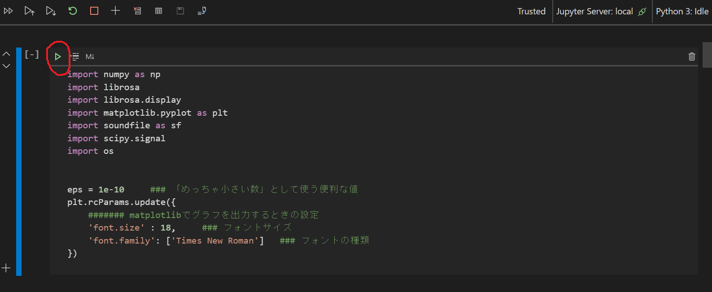

# B3研修(音響)

2021/01/14更新  
文責：工藤魁  

## 研修内容(予定)
1. wavの取り扱い，STFT，周波数フィルタ
1. ピッチ，テンポシフト，エコーなど
1. 音程推定，採譜

## Jupyterの使い方
- VSCodeだととても都合がいい
- Jupyterの拡張機能をExtensionsで検索してインストールしておく
- .ipynb形式のファイルをVSCodeで開くとJupyter Notebookの形式で扱える(Trustなどの選択肢が出る場合はTrustする)
- 再生ボタン(▷)みたいなのを押すと，そのブロックの中身が実行される

- ブロックごとに実行でき，変数はブロックをまたいで有効なので，たくさんグラフを表示したい時など便利

## 初期設定
1. audio_processingディレクトリを研修で使っているワークスペースに置く
1. VSCodeのターミナルをaudio_processingディレクトリに移動
1. 必要なライブラリを入れる
    - VSCodeのターミナルで `conda env create --file env.yaml` を実行してb3_audioの仮想環境がエラーなく入れば一番楽． その後 `conda activate b3_audio` として有効にするか，VSCodeのインタプリタの設定で適用する
    - もし入れられなかった場合，env.yamlの"dependencies"内に書かれたライブラリを，ターミナルで `conda install numpy` のように実行することで1つずつ入れていく．  `conda list` を実行して既に入っているものはパスしてオッケー． いくつかのライブラリは `conda install -c conda-forge numpy` みたいにしないと入らないものがあるので注意
    - ターミナルでcondaが実行できなかった場合，あるいは普段pipでライブラリを入れているなら， `pip install ***` でもいい． こっちはconda-forgeいらない
    - ここでつまずいた場合速やかに担当の人に聞く．
1. もし .wavのデータを持っていてそれを使いたい場合，wav_data/input ディレクトリ内に入れる． 使いたいデータが .mp3 だったり，こちらで用意された .mp3 を使いたい場合，mp3_data ディレクトリに入れ，convert_mp3towav.py を実行して.wavに変換する

## 研修でやること
- 各課題のNotebook(.ipynb形式のやつ)を開き，順に実行していく
- ``####### WRITE HERE ##############``    ``#################################`` で囲まれた部分に，指定された通りの記述を行う
- 書き込んだNotebookと，入出力データ(.wav)を提出